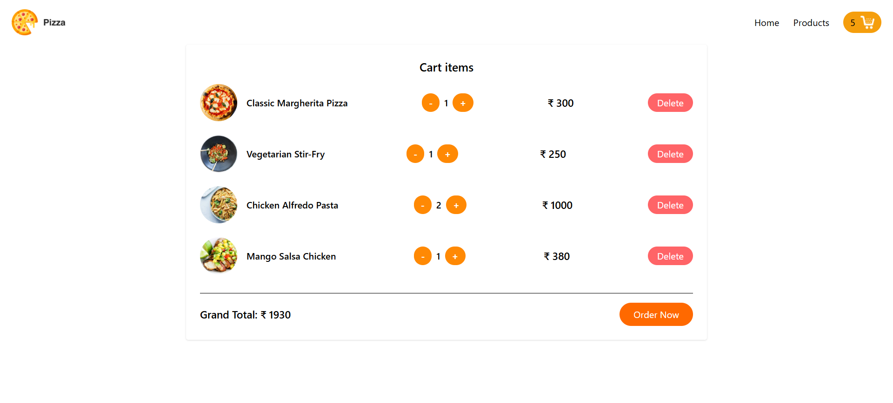

<h1 align="center">🍔 React Online Food App</h1>

<p align="center">
  
  <a href="https://react-online-food.vercel.app/" target="_blank">Live Demo</a> • 
  <a href="https://github.com/developershikhatyagi/React-online-food" target="_blank">Source Code</a>
</p>

<p align="center">
  A sleek, fully responsive and blazing fast online food ordering web app built with React.js ⚛️.
</p>

---

## 🚀 Live Preview

🔗 [Visit the App Now](https://react-online-food.vercel.app/)

---

## 📸 Screenshots

| Home Page | Cart |
|-----------|------|
|  |   |

> 💡 Tip: You can upload screenshots on [imgur.com](https://imgur.com) or GitHub issues and use the link here.

---

## 🛠️ Tech Stack

- ⚛️ **React.js** — Component-based UI
- 📦 **Context API** — Global State Management
- 🧪 **useEffect / useState** — React Hooks
- 🎨 **Tailwind CSS** — Modern UI Styling
- 🔥 **DummyJSON API** — For product/recipe data
- 🚀 **Vercel** — Live deployment

---

## 🧩 Features

✅ Responsive UI (Mobile + Desktop)  
✅ Dynamic Product Fetching  
✅ Add/Remove/Increment/Decrement Items in Cart  
✅ Grand Total Calculation  
✅ Delete Cart Items  
✅ Toast Notification (Optional)  
✅ Clean Component Structure  

---

## 📂 Folder Structure

```

React-online-food/
│
├── public/
│   └── images/
│
├── src/
│   ├── components/       → Reusable UI Components
│   ├── Pages/            → Cart, Home, etc.
│   ├── CartContext.js    → React Context API
│   ├── App.js            → Root App Component
│   └── index.js          → Entry Point
│
├── package.json
└── README.md

````

---

## ⚙️ Installation & Running Locally

```bash
git clone https://github.com/developershikhatyagi/React-online-food
cd React-online-food
npm install
npm start
````

Open 👉 `http://localhost:3000` in your browser.

---

## 💻 Developer

👩‍💻 **Shikha Tyagi**
🔗 [GitHub](https://github.com/developershikhatyagi)
🔗 [Portfolio (Coming Soon)]()
📧 [shikhatyagi@example.com](mailto:shikhatyagi@example.com)

---

## 🏁 Feedback & Contribution

Have suggestions or want to contribute? Feel free to open issues or pull requests. ⭐️ Star the repo if you like it!

---

## 📃 License

This project is licensed under the **MIT License** — you are free to use, modify, and share it.

---

> Made with ❤️ by Shikha Tyagi using React.js and creativity.

```

